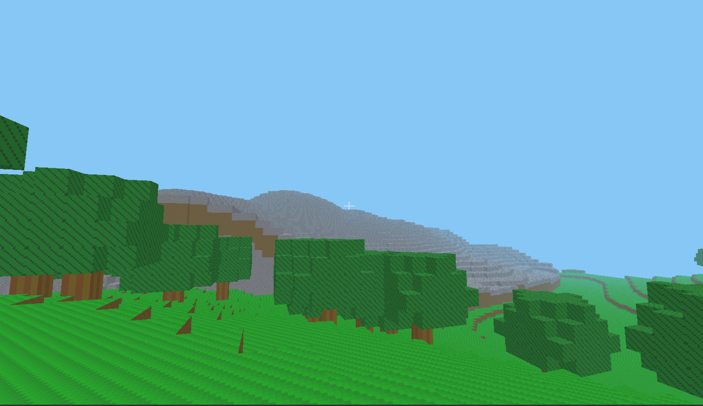
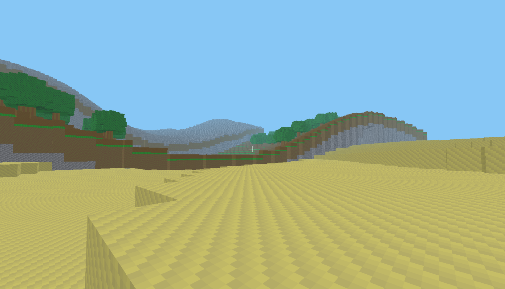

# ValCraft

<p align="center">
  <strong>Prototype de jeu voxel FPS en C++20</strong>
  <br>
  Monde procedural, rendu OpenGL, interactions voxel et pipeline strict anti-regression.
</p>

<p align="center">
  <a href="https://github.com/Donj63000/ValCraft-Official-Game-/actions/workflows/strict.yml">
    
  </a>
  
  
  
  
  
  
</p>

<p align="center">
  <a href="#apercu">Apercu</a> |
  <a href="#captures">Captures</a> |
  <a href="#fonctionnalites">Fonctionnalites</a> |
  <a href="#demarrage-rapide">Demarrage rapide</a> |
  <a href="#controles">Controles</a> |
  <a href="#roadmap">Roadmap</a>
</p>

<p align="center">
  
</p>

## Apercu

ValCraft est un prototype de moteur/jeu voxel en vue a la premiere personne, inspire par Minecraft et developpe en `C++20` avec `SDL2` et `OpenGL 3.3 Core`.

Le projet vise une base technique solide et evolutive:

- monde procedural par chunks
- deplacement FPS avec collisions et gravite
- casse et pose de blocs en temps reel
- generation deterministe et streaming du monde
- pipeline de verification strict pour limiter les regressions

> ValCraft est aujourd'hui une V1 jouable du moteur: le coeur sandbox est present, et le projet est structure pour grandir proprement.

## Pourquoi ValCraft

| Monde voxel | Gameplay FPS | Qualite logicielle |
| --- | --- | --- |
| Chunks `16 x 128 x 16`, terrain procedural, biomes legers, caves et arbres. | Controle souris/clavier, saut, collisions, mode fly debug, raycast bloc par bloc. | `21` tests automatises, smoke test, warnings stricts, couverture critique et CI GitHub. |

## Captures

<table>
  <tr>
    <td width="50%">
      
    </td>
    <td width="50%">
      
    </td>
  </tr>
  <tr>
    <td align="center">
      <strong>Biome vert, relief vallonne, foret procedurale</strong>
    </td>
    <td align="center">
      <strong>Zone sableuse, falaises rocheuses et grande visibilite</strong>
    </td>
  </tr>
</table>

## Fonctionnalites

### Monde

- chunks streames autour du joueur
- seed deterministe
- generation de relief et de surface par bruit
- palette V1: `Air`, `Grass`, `Dirt`, `Stone`, `Sand`, `Wood`, `Leaves`
- maillage de chunks avec suppression des faces cachees

### Gameplay

- deplacement `WASD`
- vue souris en premiere personne
- saut avec gravite
- collisions joueur contre blocs solides
- mode fly debug
- casse de blocs au clic gauche
- pose de blocs au clic droit
- prevention de pose dans le volume du joueur

### Pipeline de qualite

- build `CMake` en `C++20`
- dependances gerees via `FetchContent`
- warnings stricts avec `-Werror`
- suite de tests automatises
- smoke test non interactif
- verification de couverture critique
- gate locale et CI executees via le meme script

## Demarrage rapide

### Prerequis

- Windows
- GCC / MinGW
- Ninja
- OpenGL `3.3 Core`
- CLion ou terminal PowerShell

### Build

```powershell
cmake -S . -B cmake-build-debug -G Ninja
cmake --build cmake-build-debug --target ValCraft --parallel
```

### Lancer le jeu

```powershell
.\cmake-build-debug\bin\ValCraft.exe
```

### Lancer les tests

```powershell
cmake --build cmake-build-debug --target valcraft_tests --parallel
ctest --test-dir cmake-build-debug --output-on-failure
```

### Lancer la gate stricte complete

```powershell
powershell -ExecutionPolicy Bypass -File .\scripts\check.ps1
```

Cette verification controle:

- la compilation stricte
- la presence d'au moins `20` tests
- l'execution complete de la suite de tests
- un smoke test du jeu
- une couverture critique minimale sur les modules coeur

## Controles

| Action | Touche |
| --- | --- |
| Avancer / reculer | `W` / `S` |
| Strafe gauche / droite | `A` / `D` |
| Saut | `Space` |
| Monter / descendre en fly | `Space` / `Ctrl` |
| Basculer le mode fly | `F` |
| Liberer / reprendre la souris | `Escape` |
| Casser un bloc | `Clic gauche` |
| Poser un bloc | `Clic droit` |
| Selection du bloc actif | `1` a `7` |

## Stack technique

- `C++20`
- `CMake 3.24+`
- `SDL2`
- `OpenGL 3.3 Core`
- `glad`
- `glm`
- `FastNoiseLite`
- `doctest`

Toutes les dependances sont recuperees automatiquement via `FetchContent`.

## Architecture

```text
src/
  app/         Boucle de jeu, initialisation SDL/OpenGL
  gameplay/    Controle joueur, collisions, interactions monde
  render/      Shaders, atlas, meshes GPU, rendu OpenGL
  world/       Blocs, chunks, generation, raycast, meshing

tests/
  Tests unitaires et de regression

scripts/
  Gate stricte locale

.github/workflows/
  CI Windows qui execute la meme gate que le local
```

## Developpement assiste par IA

Le developpement de ValCraft s'appuie aussi sur des outils d'IA pour accelerer certaines phases du projet, notamment:

- la structuration de plans de travail
- l'assistance au prototypage et a certaines implementations
- la relecture technique et l'amelioration de la documentation

Les choix techniques, l'integration dans le projet, les validations et la direction globale restent pilotes par le mainteneur du depot.

## Etat du projet

| Dans le perimetre actuel | Pas encore dans le perimetre |
| --- | --- |
| Monde procedural jouable | Multijoueur |
| Exploration FPS | Crafting |
| Modification du terrain en temps reel | Inventaire complet |
| Base moteur testee | Sauvegarde persistante complete |
| Pipeline strict anti-regression | Mobs / IA |
| CI GitHub reproductible | Eclairage dynamique avance |

## Roadmap

- sauvegarde et chargement des modifications monde
- HUD et hotbar en jeu
- optimisation du meshing
- frustum culling plus fin
- generation plus riche
- systeme d'inventaire
- sandbox plus profond et interactif

## Contribution

Les contributions sont bienvenues, surtout sur:

- la stabilite du moteur
- le gameplay voxel
- la qualite de rendu
- la couverture de tests
- l'ergonomie du pipeline de build

Avant toute proposition de changement:

```powershell
powershell -ExecutionPolicy Bypass -File .\scripts\check.ps1
```

## Licence

Ce projet est distribue sous la licence [Apache-2.0](LICENSE).

Voir aussi le fichier [NOTICE](NOTICE) pour l'attribution du projet.
