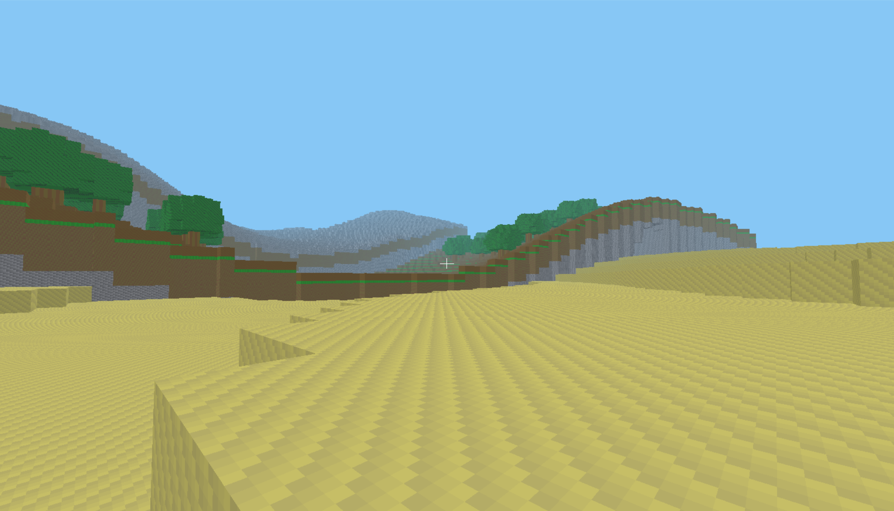

# ValCraft

[](https://github.com/Donj63000/ValCraft-Official-Game-/actions/workflows/strict.yml)


ValCraft est un prototype de jeu voxel en vue a la premiere personne, inspire par Minecraft, developpe en `C++20` avec `SDL2` et `OpenGL 3.3 Core`.

L'objectif du projet est de construire une base moteur solide, testee et evolutive: monde procedural par chunks, deplacement FPS, collisions, casse et pose de blocs, pipeline de build strict et protection anti-regression.

## Captures d'ecran




## Apercu

ValCraft propose deja une base jouable avec:

- un monde voxel procedural genere a partir d'une seed deterministe
- un streaming de chunks autour du joueur
- un rendu OpenGL avec atlas voxel et faces cachees supprimees
- un controle FPS avec souris, gravite, saut et collisions
- un mode debug fly
- un raycast voxel pour casser et poser des blocs
- une suite de tests automatises et une gate stricte locale/CI

Le projet est actuellement positionne comme une **V1 jouable du moteur**, pas encore comme un jeu complet avec crafting, inventaire avance, mobs ou multijoueur.

## Fonctionnalites actuelles

### Monde voxel

- Chunks de `16 x 128 x 16`
- Palette de blocs V1: `Air`, `Grass`, `Dirt`, `Stone`, `Sand`, `Wood`, `Leaves`
- Generation procedural avec relief, biomes legers, caves simples et arbres
- Monde deterministe base sur une seed fixe

### Gameplay

- Deplacement `WASD`
- Vue souris en premiere personne
- Saut avec gravite
- Collisions joueur contre blocs solides
- Mode fly debug activable
- Casse de blocs au clic gauche
- Pose de blocs au clic droit
- Prevention de pose dans le volume du joueur

### Qualite logicielle

- Build `CMake` propre en `C++20`
- Warnings stricts avec `-Werror`
- Suite de `21` tests automatises
- Smoke test non interactif
- Verification de couverture critique
- Workflow GitHub Actions execute sur `push` et `pull_request`

## Commandes du jeu

| Action | Touche |
| --- | --- |
| Avancer / reculer | `W` / `S` |
| Strafe gauche / droite | `A` / `D` |
| Saut | `Space` |
| Monter / descendre en fly | `Space` / `Ctrl` |
| Basculer le mode fly | `F` |
| Liberer / reprendre la souris | `Escape` |
| Casser un bloc | `Clic gauche` |
| Poser un bloc | `Clic droit` |
| Selection bloc 1 a 7 | `1` a `7` |

## Stack technique

- `C++20`
- `CMake 3.24+`
- `SDL2`
- `OpenGL 3.3 Core`
- `glad`
- `glm`
- `FastNoiseLite`
- `doctest`

Toutes les dependances sont recuperees automatiquement via `FetchContent`.

## Build et lancement

### Prerequis

Configuration cible actuelle:

- Windows
- CLion ou terminal PowerShell
- GCC / MinGW
- Ninja
- OpenGL 3.3 disponible

### Build en local

```powershell
cmake -S . -B cmake-build-debug -G Ninja
cmake --build cmake-build-debug --target ValCraft --parallel
```

### Lancer le jeu

```powershell
.\cmake-build-debug\bin\ValCraft.exe
```

### Lancer les tests

```powershell
cmake --build cmake-build-debug --target valcraft_tests --parallel
ctest --test-dir cmake-build-debug --output-on-failure
```

### Lancer la verification stricte complete

```powershell
powershell -ExecutionPolicy Bypass -File .\scripts\check.ps1
```

Cette gate verifie:

- la compilation stricte
- la presence d'au moins 20 tests automatises
- l'execution complete de la suite de tests
- un smoke test du jeu
- une couverture critique minimale sur les modules coeur

## Structure du projet

```text
src/
  app/         Boucle de jeu, initialisation SDL/OpenGL
  gameplay/    Controle joueur, collisions, interaction monde
  render/      Shaders, atlas, meshes GPU, rendu OpenGL
  world/       Blocs, chunks, generation, raycast, meshing

tests/
  Tests unitaires et de regression

scripts/
  Gate stricte locale

.github/workflows/
  CI Windows qui execute la meme gate que le local
```

## Etat du projet

Le projet est en developpement actif avec une base deja fonctionnelle pour:

- explorer un monde procedural
- deplacer un personnage FPS dans des voxels
- modifier le terrain en temps reel
- valider les changements avec une chaine stricte

Ce qui n'est pas encore dans le perimetre actuel:

- multijoueur
- crafting
- inventaire complet
- sauvegarde persistante du monde
- mobs / IA
- eclairage dynamique avance

## Roadmap

Pistes naturelles pour la suite:

- sauvegarde et chargement des modifications monde
- hotbar et HUD in-game
- optimisation du meshing
- frustum culling plus fin
- generation plus riche
- systeme d'inventaire
- interaction d'objets et gameplay sandbox plus complet

## Contribution

Les contributions sont les bienvenues, en particulier sur:

- stabilite du moteur
- gameplay voxel
- qualite de rendu
- couverture de tests
- ergonomie du pipeline de build

Avant de proposer un changement, il est recommande de lancer:

```powershell
powershell -ExecutionPolicy Bypass -File .\scripts\check.ps1
```

## Licence

Aucune licence n'est encore definie dans le depot.
Si tu veux ouvrir le projet publiquement de maniere claire, il faudra ajouter un fichier `LICENSE`.
