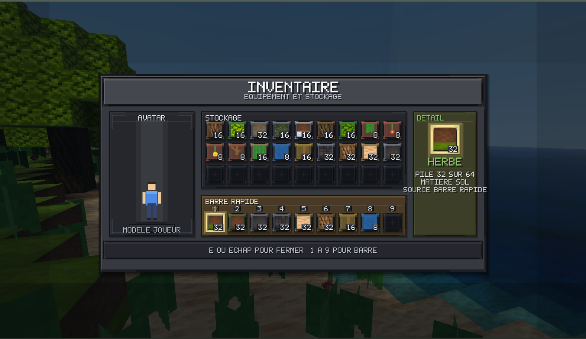
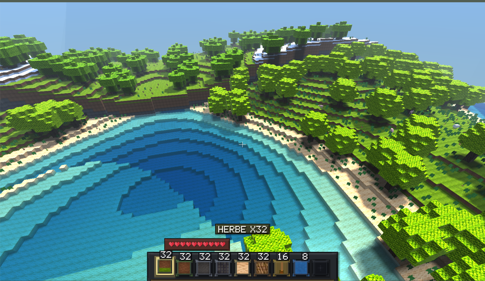
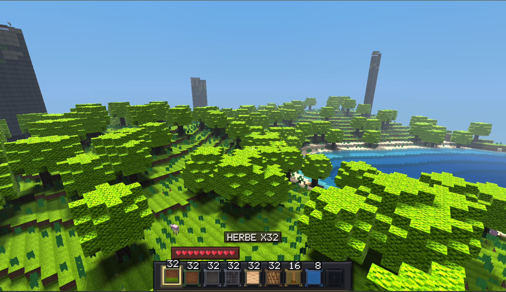
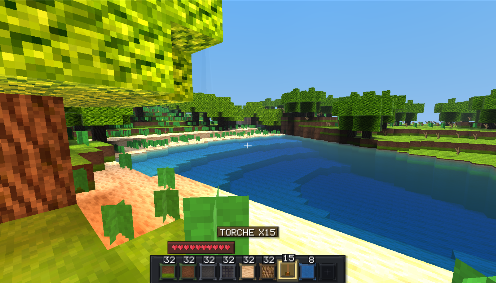
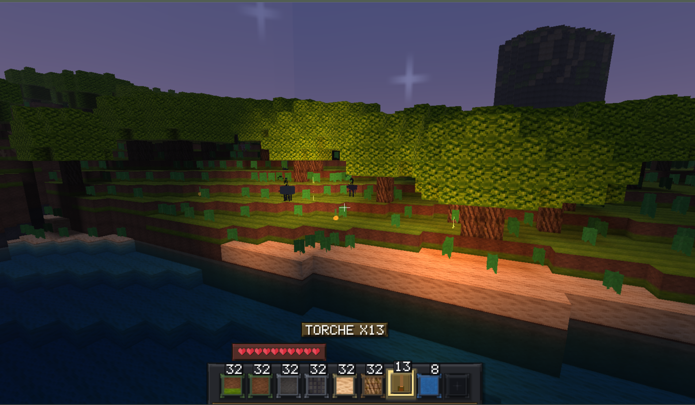
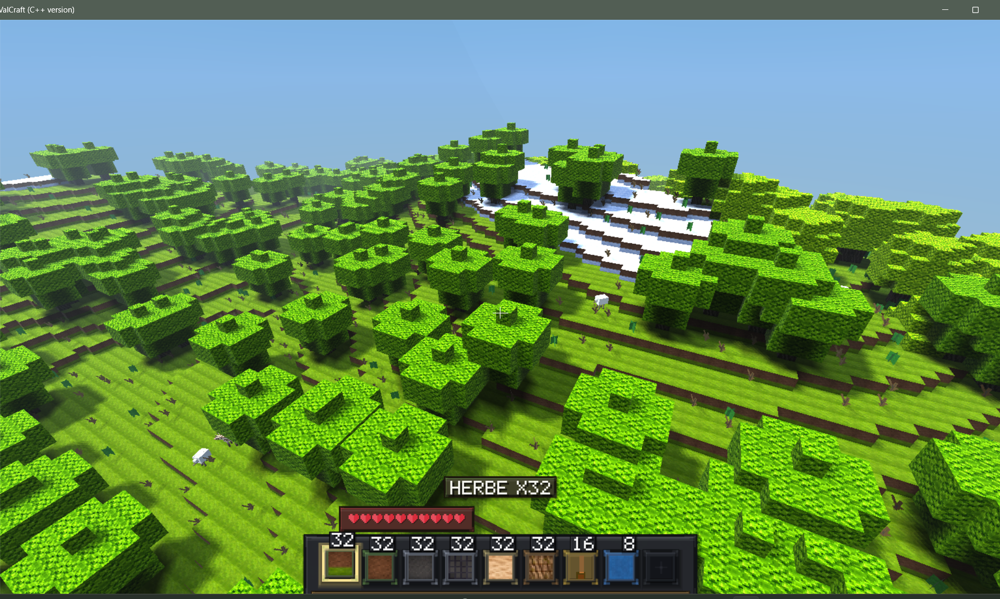
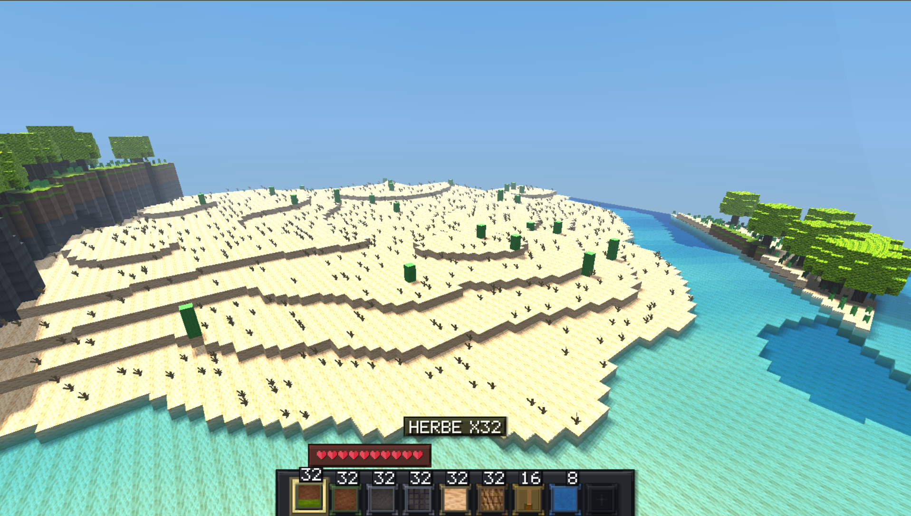
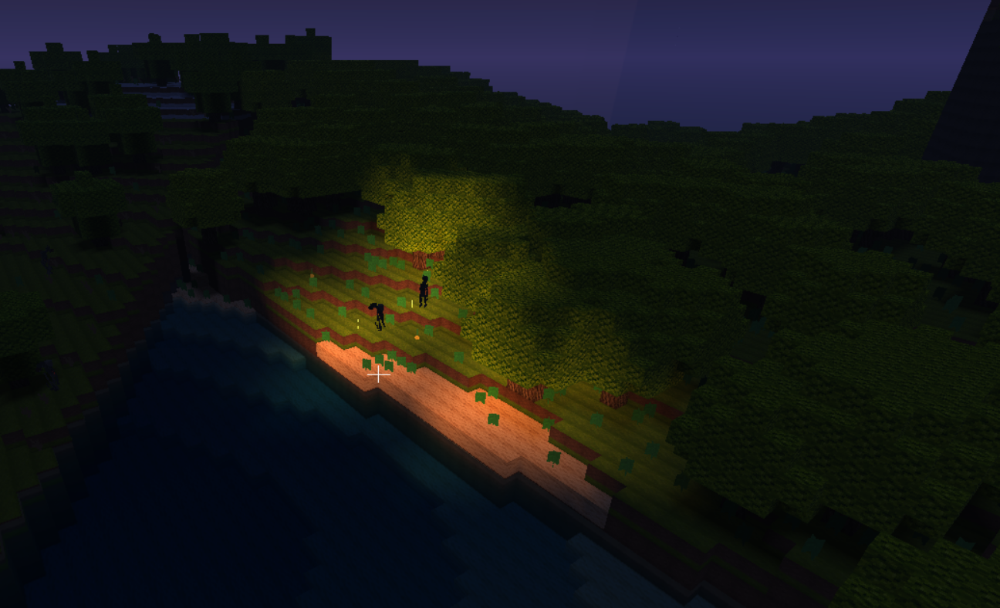

# ValCraft

<p align="center">
  <strong>Sandbox voxel solo en C++20 / OpenGL, construit comme un vrai projet moteur-jeu</strong>
  <br>
  ValCraft est mon remake libre "dans l'esprit de Minecraft" : un monde procedural, une boucle FPS immediate,
  un terrain modifiable en temps reel et une base technique que je fais evoluer proprement.
</p>

<p align="center">
  <a href="https://github.com/Donj63000/ValCraft-Official-Game-/actions/workflows/strict.yml">
    
  </a>
  
  
  
  
  
</p>

<p align="center">
  <a href="#apercu">Apercu</a> |
  <a href="#points-forts">Points forts</a> |
  <a href="#captures">Captures</a> |
  <a href="#fonctionnalites">Fonctionnalites</a> |
  <a href="#etat-actuel">Etat actuel</a> |
  <a href="#demarrage-rapide">Demarrage rapide</a> |
  <a href="#controles">Controles</a> |
  <a href="#architecture">Architecture</a> |
  <a href="#roadmap">Roadmap</a>
</p>

<p align="center">
  
  <br>
  <em>Une V1 jouable, deja lisible visuellement, encore en construction, mais pensee pour grandir proprement.</em>
</p>

## Apercu

ValCraft est un projet personnel de sandbox voxel developpe en `C++20`, `SDL2` et `OpenGL 3.3 Core`.
L'objectif n'est pas seulement de refaire une boucle de jeu "a la Minecraft", mais de construire une base
technique propre, testee et evolutive pour un vrai projet de jeu.

Aujourd'hui, le depot propose deja une experience jouable : exploration d'un monde procedural, deplacement
en vue FPS, casse et pose de blocs, eau traversable et nageable, creatures jour/nuit, hotbar, inventaire,
item drops, HUD, ecran de mort et pipeline de build/validation automatise.

Le projet reste en developpement actif. La base est solide, le coeur sandbox est deja la, mais il reste
encore des systems a approfondir, des bugs a corriger et du contenu a enrichir.

## Points forts

| Jouable maintenant | Techniquement solide | Pense pour evoluer |
| --- | --- | --- |
| Monde procedural, boucle FPS immediate, blocs cassables/placables, eau, creatures, inventaire et respawn. | Build `CMake`, `FetchContent`, warnings stricts, tests `doctest`, smoke test, couverture critique et CI Windows. | Architecture separee par modules, workflow reproductible, captures regulieres et roadmap claire. |

## Ce que propose deja ValCraft

- un monde voxel genere proceduralement avec seed deterministe
- des deplacements FPS avec collisions, saut, nage, plongee et mode fly debug
- une interaction directe avec le terrain : casser, poser, remplacer certaines decorations
- une boucle sandbox plus complete que la simple demo terrain : hotbar, inventaire, item drops et respawn
- des creatures avec cycle jour/nuit : animaux passifs le jour, zombies agressifs la nuit
- un rendu deja lisible avec eau translucide, torches emissives, vegetation decorative et presentation FPS
- un projet code comme un vrai depot de production, pas juste un prototype jetable

## Captures

<table>
  <tr>
    <td width="50%">
      
    </td>
    <td width="50%">
      
    </td>
  </tr>
  <tr>
    <td align="center">
      <strong>Explorer un monde ouvert procedural deja agreable a parcourir</strong>
    </td>
    <td align="center">
      <strong>Lire rapidement le relief, les volumes et la structure du terrain</strong>
    </td>
  </tr>
  <tr>
    <td width="50%">
      
    </td>
    <td width="50%">
      
    </td>
  </tr>
  <tr>
    <td align="center">
      <strong>Retrouver les bases du sandbox voxel avec une UI deja en place</strong>
    </td>
    <td align="center">
      <strong>Modifier le terrain en temps reel avec une boucle simple et directe</strong>
    </td>
  </tr>
  <tr>
    <td width="50%">
      
    </td>
    <td width="50%">
      
    </td>
  </tr>
  <tr>
    <td align="center">
      <strong>Eau, brume, contrastes et silhouettes donnent deja une vraie ambiance</strong>
    </td>
    <td align="center">
      <strong>Le prototype commence deja a ressembler a un vrai jeu jouable</strong>
    </td>
  </tr>
  <tr>
    <td colspan="2" align="center">
      
    </td>
  </tr>
  <tr>
    <td colspan="2" align="center">
      <strong>Un panorama qui montre bien la direction du projet : un sandbox voxel simple, propre et evolutif</strong>
    </td>
  </tr>
</table>

## Fonctionnalites

### Gameplay

- exploration libre en vue FPS
- collisions joueur / terrain, chute, degats de chute, nage et gestion de l'air sous l'eau
- hotbar `9` slots avec selection clavier et roulette
- inventaire jouable avec drag/drop, split de stack, echanges hotbar et drop d'objets
- casse de blocs au clic gauche et pose de blocs au clic droit
- torches placables avec lumiere
- objets recoltes transformes en item drops recuperables
- ecran de mort, respawn et menu pause
- cycle de creatures avec animaux le jour et zombies offensifs la nuit

### Monde et rendu

- generation procedurale deterministe
- streaming de chunks autour du joueur
- meshing avec suppression des faces cachees
- eau translucide avec surface ondulante continue
- propagation de la lumiere des torches et calcul de lumiere du ciel
- atlas de blocs et d'accents, vegetation decorative, silhouettes de creatures distinctes
- culling camera / shadow pass et presentation FPS separee du corps monde

### Pour les devs

- `C++20`, `CMake 3.24+`, `SDL2`, `OpenGL 3.3 Core`, `glad`, `glm`, `FastNoiseLite`, `doctest`
- dependances recuperees automatiquement via `FetchContent`
- warnings stricts avec `-Werror`
- tests unitaires et de regression
- smoke test non interactif du jeu
- verification de couverture critique
- meme logique de verification en local et en CI GitHub Actions

## Etat actuel

| Deja en place | En consolidation | Pas encore prioritaire |
| --- | --- | --- |
| Monde sandbox solo jouable | Sauvegarde persistante complete | Multijoueur |
| Boucle FPS, hotbar, inventaire, drops | Enrichissement du contenu sandbox | Crafting profond |
| Creatures jour/nuit | Optimisations moteur et rendu | Progression longue type RPG |
| Pipeline de qualite local + CI | Stabilisation generale et polish | Gros systeme de quetes / narration |

## Demarrage rapide

### Prerequis

- Windows
- GCC / MinGW
- Ninja
- OpenGL `3.3 Core`
- PowerShell ou CLion

> Le script `scripts/check.ps1` sait retrouver automatiquement les outils `cmake`, `ctest`, `gcov`, `ninja`
> et MinGW depuis une installation CLion recente si besoin.

### Build

```powershell
cmake -S . -B cmake-build-relwithdebinfo -G Ninja -DCMAKE_BUILD_TYPE=RelWithDebInfo
cmake --build cmake-build-relwithdebinfo --target ValCraft --parallel
```

### Lancer le jeu

```powershell
.\cmake-build-relwithdebinfo\bin\ValCraft.exe
```

### Lancer les tests

```powershell
cmake --build cmake-build-relwithdebinfo --target valcraft_tests --parallel
ctest --test-dir cmake-build-relwithdebinfo --output-on-failure
```

### Lancer un smoke/perf run

```powershell
powershell -ExecutionPolicy Bypass -File .\scripts\perf.ps1 -Configuration RelWithDebInfo
```

### Lancer la gate stricte complete

```powershell
powershell -ExecutionPolicy Bypass -File .\scripts\check.ps1
```

Cette verification controle notamment :

- la compilation stricte
- la decouverte d'un volume minimal de tests
- l'execution complete de la suite
- des smoke runs du jeu a plusieurs moments du cycle jour/nuit
- une couverture critique minimale sur les modules coeur

## Controles

| Action | Touche |
| --- | --- |
| Avancer / reculer | `W` / `S` |
| Strafe gauche / droite | `A` / `D` |
| Saut | `Space` |
| Nager / monter | `Space` |
| Plonger / descendre | `Ctrl` |
| Basculer le fly debug | `F` |
| Ouvrir / fermer l'inventaire | `E` |
| Pause / reprendre | `Escape` |
| Casser un bloc | `Clic gauche` |
| Poser un bloc | `Clic droit` |
| Selection hotbar | `1` a `9` / roulette souris |
| Drop d'objet | `Q` |
| Drop de pile complete | `Ctrl + Q` |

## Stack technique

- `C++20`
- `CMake 3.24+`
- `SDL2`
- `OpenGL 3.3 Core`
- `glad`
- `glm`
- `FastNoiseLite`
- `doctest`

Toutes les dependances sont recuperees automatiquement via `FetchContent`.

## Architecture

```text
src/
  app/         Boucle de jeu, UI, branding, options, controles
  gameplay/    Controle joueur, collisions, interactions et drops
  player/      Geometrie et presentation du joueur
  creatures/   Spawn, logique, rendu et silhouettes des creatures
  render/      Renderer OpenGL, culling, shaders, HUD et viewmodel
  world/       Blocs, chunks, generation, eclairage, meshing, streaming

tests/
  Tests unitaires et de regression

scripts/
  Checks, smoke/perf et verification locale

.github/workflows/
  CI Windows qui execute la meme logique stricte que le local
```

## Qualite et pipeline

Le depot est structure pour limiter les regressions et garder une base saine pendant l'evolution du jeu.

- la CI Windows lance une gate stricte sur chaque `push` et `pull_request`
- le script `scripts/check.ps1` prepare des builds frais pour les checks stricts et la couverture
- les tests couvrent le gameplay, le monde, le rendu, l'UI, l'inventaire et les creatures
- les smoke runs valident que le jeu peut tourner sans interaction utilisateur
- les checks locaux et la CI reposent sur la meme logique pour eviter les surprises

## Roadmap

- sauvegarde et chargement des modifications du monde
- enrichissement du contenu sandbox et de l'inventaire
- optimisation du meshing, du streaming et du rendu
- generation plus riche et plus variee
- approfondissement des creatures et de l'interactivite du monde
- consolidation generale de la V1 avant d'ouvrir des features plus ambitieuses

## Contribution

Les contributions sont bienvenues, surtout sur :

- la stabilite du moteur et du pipeline
- le gameplay voxel
- le rendu et la lisibilite visuelle
- la couverture de tests
- l'ergonomie du build et de la CI

Avant toute proposition de changement :

```powershell
powershell -ExecutionPolicy Bypass -File .\scripts\check.ps1
```

## Developpement assiste par IA

Le developpement de ValCraft s'appuie aussi sur des outils d'IA pour accelerer certaines phases :
documentation, relecture technique, prototypage, structuration de plans de travail et certaines
implementations. Les choix techniques, l'integration finale, les validations et la direction globale
restent pilotes par le mainteneur du depot.

## Licence

Ce projet est distribue sous la licence [Apache-2.0](LICENSE).

Voir aussi le fichier [NOTICE](NOTICE) pour l'attribution du projet.
